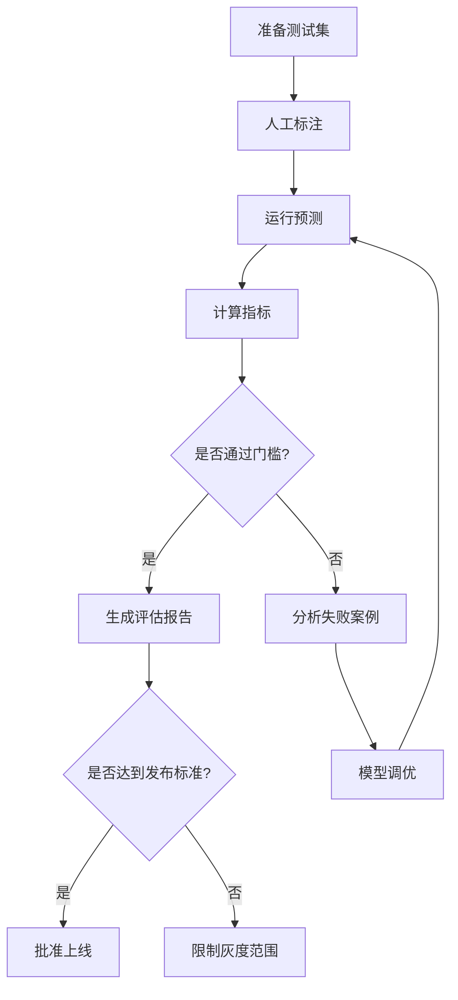
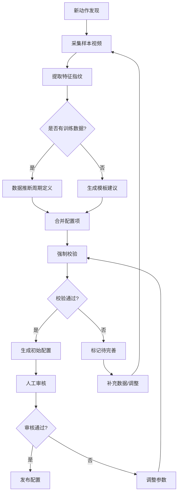

# 动作分析系统统一输出契约与评估协议

## 文档信息

| 属性 | 值 |
|------|-----|
| 版本 | 2.0.0 |
| 状态 | 正式发布 |
| 适用范围 | 批量分析 API / 实时分析 API / 训练评估 |

---

## 1. 统一输出契约

### 1.1 输出格式分层

```
AnalysisResult (根对象)
├── api_version          # API版本标识
├── action_id            # 动作标识
├── action_config        # 使用的配置信息
├── processing_info      # 处理元信息
├── phases               # 阶段检测结果
├── rep_count            # 动作计数结果
├── metrics              # 检测项结果集（核心）
│   └── {metric_id}      # 单个检测项
│       ├── definition   # 检测项定义（精简）
│       ├── runtime      # 运行时数据
│       ├── evaluation   # 阈值评估结果
│       └── errors       # 错误识别结果
└── overall              # 整体评估
```

### 1.2 字段必填/可选规范

#### 根级别字段

| 字段 | 类型 | 批量 | 实时 | 说明 |
|------|------|------|------|------|
| `api_version` | string | **必填** | **必填** | 格式："2.0.0" |
| `action_id` | string | **必填** | **必填** | 动作标识符 |
| `action_config` | object | **必填** | **必填** | 使用的配置摘要 |
| `processing_info` | object | **必填** | **必填** | 处理时间、帧数等 |
| `phases` | array | **必填** | 可选 | 阶段序列（实时可简化） |
| `rep_count` | object | **必填** | **必填** | 动作计数（无配置时count=0） |
| `metrics` | object | **必填** | **必填** | 检测项结果集 |
| `overall` | object | **必填** | **必填** | 整体评估摘要 |

#### 检测项结果字段（metrics/{metric_id}）

| 字段 | 类型 | 批量 | 实时 | 说明 |
|------|------|------|------|------|
| `metric_id` | string | **必填** | **必填** | 检测项标识 |
| `name` | string | **必填** | **必填** | 显示名称（中文） |
| `category` | string | **必填** | **必填** | 检测项分类 |
| `unit` | string | **必填** | **必填** | 单位（度/厘米/秒等） |
| `evaluation_phase` | string | **必填** | **必填** | 评估阶段ID |
| `values` | array | **必填** | 可选 | 完整时序值（实时可省略） |
| `statistics` | object | **必填** | **必填** | 统计信息 |
| `key_frame_value` | number | **必填** | **必填** | 关键帧数值 |
| `grade` | string | **必填** | **必填** | 评估等级 |
| `score` | number | **必填** | **必填** | 评分（0-100） |
| `errors` | array | **必填** | **必填** | 识别到的错误列表 |

#### 统计信息字段（statistics）

| 字段 | 类型 | 批量 | 实时 | 说明 |
|------|------|------|------|------|
| `mean` | number | **必填** | **必填** | 平均值 |
| `std` | number | **必填** | **必填** | 标准差 |
| `min` | number | **必填** | **必填** | 最小值 |
| `max` | number | **必填** | **必填** | 最大值 |
| `sample_count` | integer | **必填** | 可选 | 样本数 |

### 1.3 版本兼容规则

#### V1 → V2 兼容

```yaml
兼容策略:
  新增字段: V1客户端可安全忽略
  字段更名: 保留旧字段别名
  结构变化: 提供扁平化视图适配器
  废弃字段: 标记deprecated但仍保留

具体映射:
  V1.metrics[].metric_id → V2.metrics.{metric_id}
  V1.metrics[].name → V2.metrics.{metric_id}.name
  V1.metrics[].values → V2.metrics.{metric_id}.values
  V1.metrics[].errors → V2.metrics.{metric_id}.errors
  
  V2新增（V1无对应）:
    - phases
    - rep_count
    - metrics.{metric_id}.grade
    - metrics.{metric_id}.score
    - metrics.{metric_id}.evaluation_phase
```

#### 响应示例（V2 完整格式）

```json
{
  "api_version": "2.0.0",
  "action_id": "squat",
  "action_config": {
    "version": "2.1.0",
    "phases": ["start", "descent", "bottom", "ascent", "end"],
    "metrics_count": 8
  },
  "processing_info": {
    "duration_ms": 1250,
    "frame_count": 300,
    "fps": 30.0,
    "processed_at": "2026-04-14T10:30:00Z"
  },
  "phases": [
    {
      "phase_id": "bottom",
      "start_frame": 45,
      "end_frame": 75,
      "duration": 1.0,
      "confidence": 0.95
    }
  ],
  "rep_count": {
    "count": 10,
    "confidence": 0.92,
    "rep_ranges": [[0, 30], [31, 60], [61, 90], [91, 120], [121, 150], [151, 180], [181, 210], [211, 240], [241, 270], [271, 300]],
    "partial_rep": null
  },
  "metrics": {
    "knee_flexion": {
      "metric_id": "knee_flexion",
      "name": "膝关节屈曲角度",
      "category": "joint_angle_sagittal",
      "unit": "degrees",
      "evaluation_phase": "bottom",
      "values": [120.5, 121.2, 119.8, ...],
      "statistics": {
        "mean": 95.3,
        "std": 15.2,
        "min": 45.0,
        "max": 125.0,
        "sample_count": 300
      },
      "key_frame_value": 118.5,
      "grade": "good",
      "score": 85.5,
      "errors": [
        {
          "error_id": "insufficient_depth",
          "name": "深蹲深度不足",
          "severity": "medium",
          "key_frame": 45,
          "key_value": 95.0
        }
      ]
    }
  },
  "overall": {
    "grade": "good",
    "score": 82.3,
    "error_count": 2,
    "summary": "动作完成良好，注意保持深蹲深度"
  }
}
```

#### 响应示例（V2 实时简化格式）

```json
{
  "api_version": "2.0.0",
  "action_id": "squat",
  "processing_info": {
    "frame_id": 150,
    "timestamp": "2026-04-14T10:30:05.000Z",
    "latency_ms": 45
  },
  "current_phase": {
    "phase_id": "ascent",
    "confidence": 0.88
  },
  "rep_count": {
    "count": 5,
    "rep_progress": 0.65
  },
  "metrics": {
    "knee_flexion": {
      "metric_id": "knee_flexion",
      "name": "膝关节屈曲角度",
      "category": "joint_angle_sagittal",
      "unit": "degrees",
      "current_value": 95.5,
      "statistics": {
        "mean": 88.2,
        "std": 12.5,
        "min": 45.0,
        "max": 120.0
      },
      "grade": "pass",
      "score": 72.0,
      "active_errors": [
        {
          "error_id": "insufficient_depth",
          "severity": "medium"
        }
      ]
    }
  }
}
```

---

## 2. 测试集评估协议

### 2.1 评估指标体系

#### 动作计数指标

| 指标 | 定义 | 计算方式 | 上线门槛 |
|------|------|----------|----------|
| **Rep Count Accuracy (RCA)** | 计数准确率 | `1 - |预测次数 - 真实次数| / 真实次数` | ≥ 95% |
| **Rep Detection Rate (RDR)** | 检出率 | `正确检出的rep数 / 真实rep总数` | ≥ 98% |
| **False Rep Rate (FRR)** | 误检率 | `错误检出的rep数 / 预测rep总数` | ≤ 5% |
| **Rep Boundary Error (RBE)** | 边界误差 | `预测边界与真实边界的帧差异均值` | ≤ 3帧 |

#### 错误识别指标

| 指标 | 定义 | 计算方式 | 上线门槛 |
|------|------|----------|----------|
| **Error Precision** | 错误识别精确率 | `TP / (TP + FP)` | ≥ 85% |
| **Error Recall** | 错误识别召回率 | `TP / (TP + FN)` | ≥ 90% |
| **Error F1-Score** | F1综合评分 | `2 * Precision * Recall / (Precision + Recall)` | ≥ 87% |
| **Severity Accuracy** | 严重度准确率 | `严重度判断正确的错误数 / 总错误数` | ≥ 80% |

#### 阶段检测指标

| 指标 | 定义 | 计算方式 | 上线门槛 |
|------|------|----------|----------|
| **Phase Accuracy** | 阶段检测准确率 | `帧级别阶段判断正确率` | ≥ 92% |
| **Phase Transition Delay** | 阶段切换延迟 | `检测到切换的帧延迟均值` | ≤ 5帧 |

#### 阈值评估指标

| 指标 | 定义 | 计算方式 | 上线门槛 |
|------|------|----------|----------|
| **Grade Consistency** | 等级一致性 | `与人工标注等级一致的比例` | ≥ 85% |
| **Score Correlation** | 评分相关性 | `预测score与人工score的Pearson相关系数` | ≥ 0.85 |

### 2.2 统计方法与显著性

#### 测试集要求

```yaml
最小样本量:
  标准动作视频: 每种动作 ≥ 10个视频
  总动作次数: ≥ 30次（用于计数评估）
  错误样本: 每种错误类型 ≥ 3个实例

数据分布:
  # 无特定分布要求（视频不包含性别/难度/角度元数据）

标注质量:
  # 无标注质量限制（无相关字段）
```

#### 统计方法

```python
# 置信区间计算
confidence_level = 0.95
margin_of_error = 1.96 * sqrt(p * (1-p) / n)

# 跨动作聚合
macro_average = mean(metric_per_action)  # 宏平均，每动作等权重
micro_average = sum(TP) / sum(TP + FP)   # 微平均，按样本加权

# 显著性检验
# 新旧版本对比使用配对t检验
# 与人工标注对比使用单样本t检验
```

### 2.3 评估流程



### 2.4 上线门槛矩阵

| 发布阶段 | RCA | Error F1 | Phase Acc | 备注 |
|----------|-----|----------|-----------|------|
| **Alpha** | ≥ 90% | ≥ 80% | ≥ 85% | 内部测试 |
| **Beta** | ≥ 93% | ≥ 84% | ≥ 90% | 小范围灰度 |
| **GA** | ≥ 95% | ≥ 87% | ≥ 92% | 正式发布 |
| **Hotfix** | ≥ 97% | ≥ 90% | ≥ 95% | 紧急修复后 |

### 2.5 回归测试触发条件

以下变更必须触发全量回归测试：
- 阶段检测算法修改
- 错误识别阈值调整
- 动作周期定义变更
- 计数器逻辑修改
- 新检测项添加

---

## 3. 新动作配置生成规范

### 3.1 CycleDefinition 优先级与 Source 记录

#### 优先级顺序

```python
class CycleDefinitionSource(Enum):
    """周期定义来源（用于追溯和审计）."""
    EXPLICIT = "explicit"           # 用户显式配置（最高优先级）
    DATA_INFERRED = "data_inferred" # 基于训练数据推断
    TEMPLATE_FALLBACK = "template"  # 模板回退（最低优先级）
    MISSING = "missing"             # 未配置（计数功能不可用）

class CycleDefinitionWithMeta(BaseModel):
    """带元信息的周期定义."""
    definition: CycleDefinition
    source: CycleDefinitionSource
    confidence: float              # 定义可信度（0-1）
    generated_at: str              # 生成时间
    generated_by: str              # 生成工具/算法
    validation_warnings: List[str] # 校验警告
```

#### 生成策略

```python
def generate_cycle_definition(
    action_id: str,
    phases: List[PhaseDefinition],
    training_data: Optional[PoseSequence] = None,
    user_config: Optional[CycleDefinition] = None
) -> CycleDefinitionWithMeta:
    """
    生成周期定义（带优先级和来源记录）.
    
    优先级：
    1. 用户显式配置 > 2. 数据推断 > 3. 模板建议 > 4. 缺失
    """
    
    # P1: 用户显式配置
    if user_config:
        is_valid, warnings = validate_reachability(user_config, phases)
        if is_valid:
            return CycleDefinitionWithMeta(
                definition=user_config,
                source=CycleDefinitionSource.EXPLICIT,
                confidence=1.0,
                generated_at=now(),
                generated_by="user",
                validation_warnings=warnings
            )
    
    # P2: 基于训练数据推断
    if training_data:
        inferred = infer_from_training_data(training_data, phases)
        if inferred:
            return CycleDefinitionWithMeta(
                definition=inferred,
                source=CycleDefinitionSource.DATA_INFERRED,
                confidence=inferred.confidence,
                generated_at=now(),
                generated_by="cycle_inference_v2",
                validation_warnings=[]
            )
    
    # P3: 模板建议（仅建议，不自动应用）
    suggested = suggest_from_template(phases)
    if suggested:
        # 返回建议但不作为最终配置
        logger.info(f"建议的周期定义: {suggested}")
    
    # P4: 缺失（允许，但计数功能不可用）
    return CycleDefinitionWithMeta(
        definition=None,
        source=CycleDefinitionSource.MISSING,
        confidence=0.0,
        generated_at=now(),
        generated_by="none",
        validation_warnings=["未配置周期定义，动作计数功能不可用"]
    )
```

### 3.2 强制校验矩阵

#### 配置完整性校验

| 校验项 | 规则 | 严重度 | 失败处理 |
|--------|------|--------|----------|
| **阶段定义** | phases 长度 ≥ 2 | Error | 拒绝配置 |
| **阶段ID唯一** | phase_id 全局唯一 | Error | 拒绝配置 |
| **周期可达性** | phase_sequence 中所有阶段在 FSM 中可达 | Error | 拒绝配置 |
| **进入/退出条件** | 每个阶段至少配置 entry_conditions 或 exit_conditions 之一 | Warning | 允许但提示 |
| **阈值区间策略** | 若 thresholds 非空，必须声明 target_value | Error | 拒绝配置 |
| **阈值包含关系** | excellent ⊆ good ⊆ pass（若不满足自动修正并警告） | Warning | 自动修正 |
| **错误条件引用** | error_conditions 中的 metric 必须存在 | Error | 拒绝配置 |
| **评估阶段存在** | evaluation_phase 必须在 phases 中 | Error | 拒绝配置 |

#### 运行时校验

| 校验项 | 规则 | 严重度 | 失败处理 |
|--------|------|--------|----------|
| **关键点存在** | 所需关键点在模型输出中存在 | Error | 跳过该检测项 |
| **数据质量** | 关键点置信度均值 ≥ 0.5 | Warning | 降低结果置信度 |
| **阶段检测** | 至少检测到一个有效阶段 | Warning | 标记分析失败 |
| **计数有效性** | rep_count.confidence ≥ 0.7 | Info | 标记低置信度 |

### 3.3 首次配置生成流程



### 3.4 配置字段完整性清单

#### 首次生成必须包含的字段

```yaml
ActionConfig:
  required:
    - action_id
    - action_name
    - action_name_zh
    - version
    - schema_version
    - phases:
        - phase_id
        - phase_name
        - entry_conditions  # 或 exit_conditions
    - metrics:
        - metric_id
        - enabled
        - evaluation_phase
    - global_params:
        - min_phase_duration
        - enable_phase_detection
  
  recommended:
    - description
    - cycle_definition:
        - phase_sequence
        - required_phases
        - start_phase
        - end_phase
    - metrics:
        - thresholds:
            - target_value
            - normal_range
            - excellent_range
            - good_range
            - pass_range
        - error_conditions:
            - error_id
            - error_name
            - severity
            - condition
        - weight
    - metadata:
        - author
        - created_at
        - tags

PhaseDefinition:
  required:
    - phase_id
    - phase_name
  
  one_of:  # 至少满足其一
    - entry_conditions
    - exit_conditions
  
  recommended:
    - description
    - min_duration
    - max_duration

MetricConfig:
  required:
    - metric_id
    - enabled
    - evaluation_phase
  
  recommended:
    - thresholds
    - error_conditions
    - weight: 1.0
```

---

## 4. 阶段别名处理规范

### 4.1 别名使用边界

```python
class PhaseAliasPolicy:
    """阶段别名使用策略（明确边界）."""
    
    # 同义词映射（仅用于配置校验和迁移提示）
    SYNONYMS = {
        "start": ["start", "initial", "ready", "setup"],
        "ascent": ["ascent", "up", "lift", "raise"],
        "descent": ["descent", "down", "lower", "drop"],
        "hold": ["hold", "static", "maintain", "pause"],
        "end": ["end", "finish", "complete", "return"],
    }
    
    # 抽象别名（不支持直接解析，需要显式配置）
    ABSTRACT = {
        "any": {
            "description": "任意阶段评估",
            "resolution": "MULTI_PHASE",  # 运行时在所有阶段评估
            "config_requirement": "必须显式列出阶段列表"
        },
        "peak": {
            "description": "极值点阶段",
            "resolution": "EXTREMUM_DETECTION",  # 运行时动态检测极值
            "config_requirement": "必须显式配置为具体极值阶段"
        }
    }
```

### 4.2 运行时处理策略

#### "any" 处理（多阶段评估）

```python
class MultiPhaseEvaluator:
    """多阶段评估器（处理 any 语义）."""
    
    def evaluate_any(
        self,
        metric_config: MetricConfig,
        phase_sequence: PhaseSequence
    ) -> List[MetricResult]:
        """
        在所有阶段评估检测项.
        
        返回每个阶段的独立评估结果，而非合并为一个.
        """
        results = []
        
        for phase in phase_sequence.detections:
            phase_result = self.evaluate_in_phase(
                metric_config,
                phase.phase_id
            )
            results.append(phase_result)
        
        return results
```

#### "peak" 处理（极值检测）

```python
class ExtremumDetector:
    """极值检测器（处理 peak 语义）."""
    
    def detect_peak_phase(
        self,
        metric_values: np.ndarray,
        metric_id: str
    ) -> Optional[str]:
        """
        动态检测极值所在阶段.
        
        基于 metric_values 的极值位置，反查对应的 phase_id.
        """
        # 检测全局极值
        peak_idx = np.argmax(metric_values)  # 或 argmin，根据 metric 类型
        
        # 查找包含该帧的阶段
        for phase in self.phase_sequence.detections:
            if phase.start_frame <= peak_idx <= phase.end_frame:
                return phase.phase_id
        
        return None
```

---

## 5. 附录

### 5.1 版本历史

| 版本 | 日期 | 变更 |
|------|------|------|
| 2.0.0 | 2026-04-14 | 初始发布，统一输出契约与评估协议 |

### 5.2 参考文档

- [动作分析系统 V2 设计方案](./action_analysis_v2_design_v2.md)
- [API 接口规范](../api/api_spec.md)
- [配置模型定义](../config/models.md)

---

**文档状态**: 正式发布  
**审核人**: [待填写]  
**批准日期**: [待填写]
