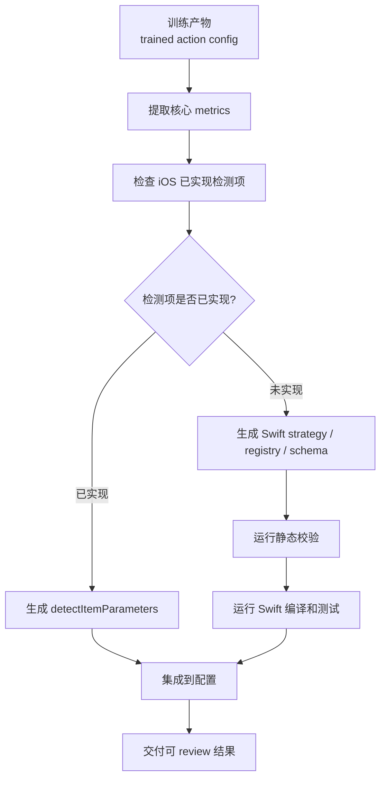
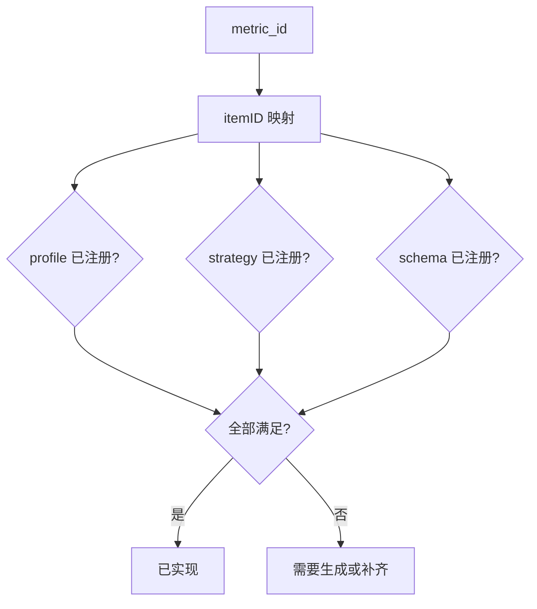
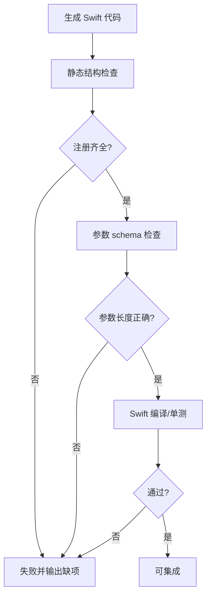
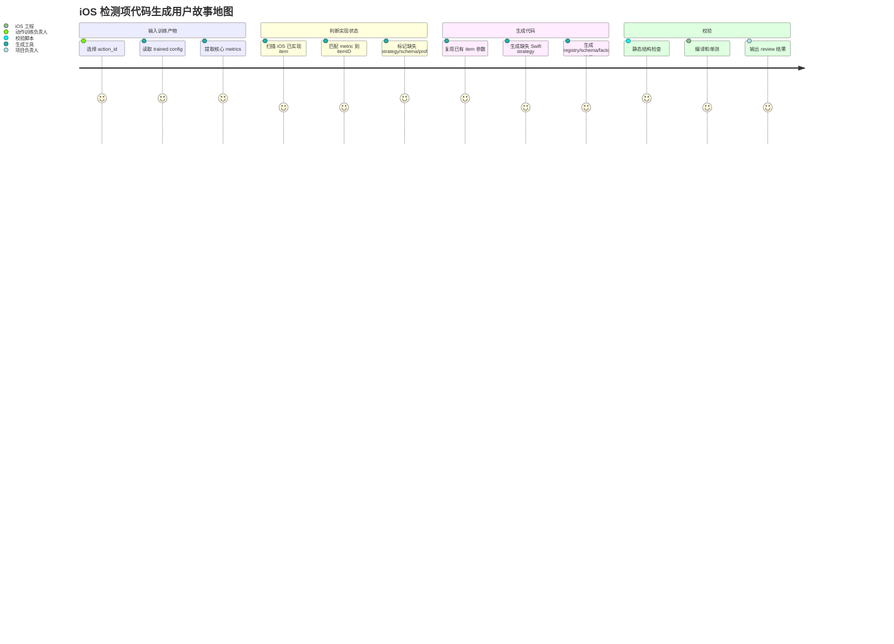

# iOS 检测项代码生成自动化方案

> [!SUMMARY]
> 本方案按最新反馈收敛为“自动生成检测项对应 iOS 代码”。不引入复杂的 Claw / Claude Code 配置，不建设重迁移包平台，也不把重点放在 prompt 工程。第一版目标是：读取 Python 训练产物，判断核心检测项在 iOS 是否已有实现；已有实现则生成配置参数，未实现则自动生成 Swift strategy、注册表、schema 接入代码；随后通过测试和构建检查，最后集成到 iOS 项目。

## 1. 核心目标

自动化流程只围绕一个问题展开：

```text
训练产物里的检测项，iOS 是否已经能执行？
```

如果 iOS 已经实现：

- 复用现有 `itemID`。
- 生成对应 `detectItemParameters`。
- 进入配置联调。

如果 iOS 没有实现：

- 自动生成 Swift 检测项策略。
- 自动生成或更新 `itemID -> profile` 注册。
- 自动生成或更新 `itemID -> strategy` 注册。
- 自动生成或更新 `itemID -> parameter schema` 注册。
- 运行测试、编译和静态检查。

最终目标不是让 LLM 写一段 prompt，而是让系统能稳定完成：

```text
判断是否实现 -> 缺失则生成代码 -> 测试 -> 集成
```

## 2. 简化后的主流程



这条链路里，最重要的是代码生成和校验，不是中间文档。

## 3. 不做什么

第一版明确不做：

- 不配置在线 LLM 服务。
- 不要求 Claude Code / Claw 作为固定依赖。
- 不建设复杂迁移包平台。
- 不输出长 prompt 作为核心产物。
- 不把动作参数硬编码进 Swift。
- 不直接修改 iOS 主链路、Bus 协议、计数与语音流程。

允许使用离线 LLM 或本地 agent 作为代码生成辅助，但它只是生成器实现手段之一，不是系统边界。

## 4. 自动化边界

### 4.1 输入

第一版输入：

- `config/action_configs/{action_id}_trained.json`
- Python 侧 metric 定义，例如 `src/core/metrics/definitions.py`
- Python 侧 metric 计算逻辑，例如 `src/core/metrics/calculator.py`
- iOS 项目路径
- iOS 已实现检测项扫描结果，或一份轻量能力表

### 4.2 输出

第一版核心输出：

- Swift strategy 文件。
- `itemID -> profile` 注册补丁。
- `itemID -> strategy` 注册补丁。
- `itemID -> parameter schema` 注册补丁。
- `detectItemIDs + detectItemParameters` 配置片段。
- 测试和编译结果。

Markdown 报告可以作为 review 视图，但不是核心链路。

## 5. 实现状态判断

判断当前检测项是否已实现，需要同时看三件事：



一个检测项只有同时满足以下条件，才算 iOS 已实现：

1. 有稳定 `itemID`。
2. `itemID -> keypoint profile` 已注册。
3. `itemID -> strategy constructor` 已注册。
4. `itemID -> parameter schema` 已注册。
5. strategy 输出仍兼容现有 `DetectionResult`。
6. 参数通过 `updateParameters` 注入，而不是写死在 Swift 里。

## 6. Swift 代码生成策略

第一版建议采用“模板优先，离线 LLM 兜底”。

### 6.1 模板优先

对于 Python 已有明确 calculator 类型的检测项，可以直接从模板生成 Swift。

示例：

| Python calculator | Swift 生成模板 |
|---|---|
| `joint_angle` | 三点角度策略模板 |
| `hip_abduction_angle` | 髋外展角度策略模板 |
| `vertical_symmetry` | 左右关键点垂直差值策略模板 |
| `vertical_elevation_ratio` | 高度比例策略模板 |

模板生成的优势：

- 可测试。
- 可重复。
- 不依赖在线 LLM。
- 生成结果稳定。

### 6.2 离线 LLM 兜底

当 calculator 类型无法模板覆盖时，再使用离线 LLM 或本地 agent 生成 Swift。

兜底生成必须受约束：

- 输入只给最小 metric spec。
- 必须遵守 iOS strategy protocol。
- 必须使用 `updateParameters`。
- 必须输出 `DetectionResult`。
- 必须通过后置 hooks。

离线 LLM 只负责生成候选代码，不负责决定映射关系和上线判断。

## 7. 检测项生成示例：straight_leg_raise

`straight_leg_raise` 的核心检测项：

| metric | iOS 状态 | 处理方式 |
|---|---|---|
| `ankle_dorsiflexion` | 已有近似实现，复用 `itemID=8` | 生成参数 |
| `knee_flexion_compensation` | 已有近似实现，复用 `itemID=7` | 生成参数 |
| `hip_abduction` | iOS 缺失 | 生成 `HipAbductionMP33Strategy` |
| `knee_symmetry` | iOS 缺失 | 生成 `KneeSymmetryMP33Strategy` |

### 7.1 `hip_abduction`

Python 侧定义：

- calculator: `hip_abduction_angle`
- required keypoints: `hip`, `knee`, `shoulder`
- 计算逻辑：肩中心到髋形成躯干向量，髋到膝形成大腿向量，计算两向量夹角。

iOS 生成目标：

- 新增 `itemID=22`。
- 使用 `mp33` profile。
- 生成 `HipAbductionMP33Strategy`。
- 参数使用 8 槽位 range schema。
- 缺少关键点时输出降级结果，不影响其他 item。

### 7.2 `knee_symmetry`

Python 侧定义：

- calculator: `vertical_symmetry`
- required keypoints: `left_knee`, `right_knee`
- 计算逻辑：左右膝关键点 y 坐标差值。

iOS 生成目标：

- 新增 `itemID=23`。
- 使用 `mp33` profile。
- 生成 `KneeSymmetryMP33Strategy`。
- 参数使用 8 槽位 range schema。
- 注意：Python 定义里 unit 写的是 `normalized`，但当前计算逻辑是直接 y 差值，首版实现需要明确是否沿用像素差或增加归一化。

## 8. 测试与校验

自动生成 Swift 后，必须跑校验。



校验项：

- strategy 文件是否生成。
- profile 注册是否补齐。
- factory 注册是否补齐。
- schema 注册是否补齐。
- 参数长度是否符合 schema。
- Swift 中是否硬编码训练阈值。
- 是否通过 `updateParameters` 注入参数。
- `mp33` 策略是否错误使用 `yolo17` 关键点。
- 是否保留统一 `DetectionResult` 输出。
- 编译和单测是否通过。

## 9. 集成方式

第一版建议默认 dry-run。

dry-run 输出：

- 生成的 Swift 文件。
- 需要插入的 registry 片段。
- 需要插入的 factory 片段。
- 需要插入的 schema 片段。
- `detectItemIDs + detectItemParameters`。
- 校验结果。

确认后再允许写入 iOS 项目。

集成写入要满足：

- 不覆盖人工已有实现。
- itemID 冲突时停止。
- strategy 已存在时不重复生成。
- registry 中已有条目时做一致性校验。
- 所有修改可通过 git diff review。

## 10. User Stories

| 角色 | 用户故事 | 验收标准 |
|---|---|---|
| 动作训练负责人 | 作为动作训练负责人，我希望训练后能自动知道 iOS 缺哪些检测项。 | 工具能输出已实现/未实现检测项列表。 |
| iOS 开发负责人 | 作为 iOS 开发负责人，我希望缺失检测项能自动生成 Swift strategy 和注册代码。 | 对 `hip_abduction`、`knee_symmetry` 能生成可 review 的 Swift 代码和注册片段。 |
| 后端配置负责人 | 作为后端配置负责人，我希望已有检测项能自动生成下发参数。 | 能输出 `detectItemIDs + detectItemParameters`。 |
| 算法验证负责人 | 作为算法验证负责人，我希望生成代码后能自动校验关键逻辑。 | 静态校验、schema 校验、编译测试可执行。 |
| 项目负责人 | 作为项目负责人，我希望第一版能具体跑通一个动作。 | `straight_leg_raise` 能完成状态判断、代码生成、测试和集成 dry-run。 |

## 11. User Story Map



## 12. 第一版范围

第一版只做一个可跑通的实现闭环：

```text
straight_leg_raise
  -> 判断 8/7 已实现
  -> 判断 22/23 未实现
  -> 生成 22/23 Swift strategy
  -> 生成注册片段和 schema 片段
  -> 生成 detectItemParameters
  -> dry-run 校验
```

不做：

- 不做完整动作平台。
- 不做在线 LLM 服务接入。
- 不做复杂 agent 编排。
- 不做自动发布。
- 不承诺一次生成代码就完全免人工 review。

## 13. 最终判断

本方案应该从“动作迁移流程自动化”进一步收敛为“检测项 iOS 代码自动生成”。

核心链路是：

```text
判断是否实现
-> 没有实现则自动生成 Swift
-> 测试确保无问题
-> 集成
```

这比配置复杂的 LLM/agent 工作流更直接，也更符合当前阶段“先具体实现一版出来”的要求。
