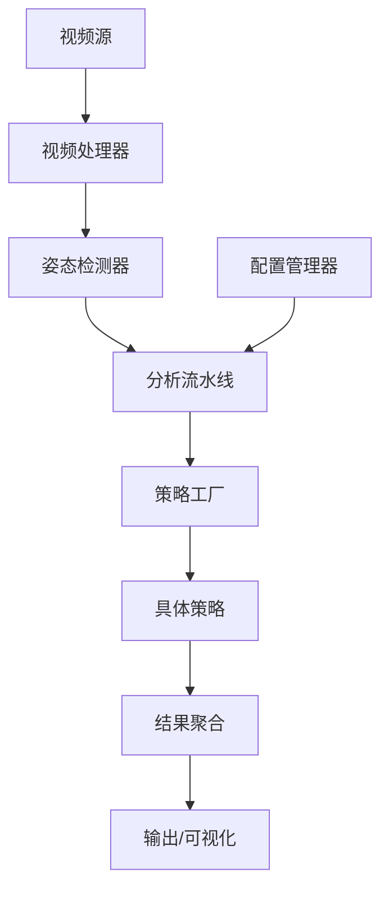

# [总] 数据 SOP

> [!TIP]
> 文档整理说明 from ou_c9418667841a13d51b2162054ef2f390 to ou_be692f19c4f54484f5e904394cecbf60：
> 1. 每一部分都应该是总分的结构。总的部分是不关注细节但需要大白话的（原则/方法论 + 结论），分的部分是具体技术细节。

# 前置背景

1. 标准作业程序（Standard Operating Procedures,SOP）：是一份详细、书面、步骤化的操作指南，把某件重复性工作的最佳流程、标准、要求固定下来。
2. **反馈通路**是系统中把**输出信号 / 结果**反向传输至**输入端**，与参考信号比较并影响后续行为的信息渠道，是闭环系统的核心组成。它本质是**输出 → 输入**的反馈路径，与**前向通路**（输入 → 输出）共同构成闭环，实现自我调节与持续优化。
3. 在采用 SOP 前我们的流程是怎样的：

第一步：准备数据集

第二步：检测项生成、选取和小规模验证

第三步：专家参与的人工数据质量审核和知识注入

1. 为什么需要 SOP：~~需要理清一个动作要上线，算法能帮我们做多少，人能帮我们做多少，什么样的人机配合方式让我们的端到端效率最高，达成可量化、可复制的动作上新流程控制，例如 3 天上线一个新动作~~~~。~~**主要目的：快速保质保量的上新动作，同时保持 SOP 主体架构不需要频繁迭代。**SOP 的人机协同部分指的是利用 AI、代码、算法快速筹备端侧动作的监测内容和标准，快速的抽取专家经验验证，快速的迭代上新的动作的质量。
2. 采用 SOP 的最终目标是：~~当产品力和 SOP 都迭代到一个较高水平的点时，我们希望推出一个类似于剪映的工具，让博主或 KOL 能够用这个工具构建和测试虚拟教练并发布，同时把我们的模块化的硬件使用能力糅合在他们提供的虚拟教练服务中。~~
   **实现视频标注、数据集构建、训练测试和调优步骤全套流程自动化。**

# 具体方案

## 20260320 前版本

By ou_be692f19c4f54484f5e904394cecbf60 整理 ➡️ ou_c9418667841a13d51b2162054ef2f390 建议 ➡️ ou_be692f19c4f54484f5e904394cecbf60 二次整理

### 核心结论

> 1. 人工在调的部分是否只包含检测项和其参数

人工在调部分只包含检测项（花费 1 小时）和 检测项参数（花费 8 小时）

> 1. 对检测项和其参数的评估能否自动完成

检测项：

检测项参数：

> 1. 到底为什么人工部分需要 10 小时，当前不能自动化的更本掣肘在哪里

**没有闭环的反馈回路，检测项和参数的生成和量化结果输出都是一次性结果，缺少测试不合格后的自动重选、微调。**

检测项组合筛选需要人工的原因本质上是**缺少把重要的先验知识固化成规则加入到筛选条件中**。

检测项参数调优需要人工的原因是**缺少“样本分层标准 + 样本权重规则 + 专用测试集自动构建”的能力。**

**3.1 检测项组合筛选：**需要人工操作的点在于选出来的组合在效果不好的时候无法直接从量化评分上定位出问题。需要人工复核问题在哪并进行修正。举例：**1. 算法在训练集里统计到了不属于动作的行为，并把这个行为标记成了显著特征，但在测试集中效果差。**

人工在参数调优里的工作量（按耗时排序）

1. **剔除错误项，重新约束筛选（最耗时，占 60%）**

手动在全量检测项池中加入约束，临时增加检测项组合的增益规则，重新触发检测项组合筛选。

1. **问题定位（占 40%）**

找出**哪一个检测项把「非动作噪声」当成了特征，**无自动化辅助，纯人工排查。

**3.2 检测项参数调优：**需要人工操作的点在于参数不会根据测试结果自动微调，只能人工手动试错。在自动测试的过程中算法无法分辨测试样本是否是极端样本，导致每个视频的权重相等，统计参数会被极端样本带偏。人工参与最耗时的地方是把这些样本分别标记为不同用途并手动配置相应任务的测试集。

人工在参数调优里的工作量（按耗时排序）

1. **样本清洗（最耗时，占 40%）**
   从所有视频里挑出：极端姿态样本（需要人工看完整视频）、拍摄有问题的样本、边缘案例样本，**把它们从通用测试集里剥离**，不让它们干扰正常参数学习。
2. **样本分用途标记（占 30%）**
   手动给每个样本打标签：

   - 普通错误/正确视频样本（用于参数学习）
   - 极端样本（用于鲁棒性校验）
   - 边缘样本（用于阈值边界校验）
   - 无效样本（直接剔除）
3. **手动配置专用测试集（占 20%）**
   按任务分开建测试集：

   - 错误识别鲁棒性效果测试集（标准样本 + 极端样本）
   - 阈值边界测试集（边缘样本）这一步单独拆分出来是因为在边界附近通过阈值确定错误一定会产生 tradeoff，这里需要人工取舍对错误的容忍度。
4. **纯参数数值微调（仅占 10%）**

> 1. 如果要进行快速的自动化，大概能缩减时间到多少

总周期从 14h → 3～4h 内

### 宏观设计

SOP 由三部分组成：

1. 数据采集与标注系统
2. 视频分析系统
3. 测试与微调系统

### 微观实现

#### 2.1.2.1 SOP - 数据采集与标注系统

数据采集系统：对所有预备上新的动作，基于专家专业知识构建符合产品需求的动作组织形式（例如：将动作拆解为标准化的质量评价点和错误分类）

数据标注系统：对齐专家的运动领域专业知识和视频中的动作质量

##### 2.1.2.1.1 流程图

##### 2.1.2.1.2 分步示例

1. 从专家处获取的动作语义

<table>
<tr>
<td>序号<br/></td><td>动作名称<br/></td><td>质量评价点<br/></td><td>描述<br/></td><td>错误分类<br/></td></tr>
<tr>
<td>1<br/></td><td>罗马尼亚硬拉<br/></td><td>臀和大腿后侧主导发力<br/></td><td>靠臀部和大腿后侧发力，整个动作以伸髋为主<br/></td><td>屈髋不足<br/></td></tr>
<tr>
<td><br/></td><td><br/></td><td>膝关节稳定，不要往前顶<br/></td><td>屈膝不能太多，屈膝时小腿不动，大腿主导屈膝，膝盖不要往前顶<br/></td><td>屈膝过度<br/><br/></td></tr>
<tr>
<td><br/></td><td><br/></td><td>脚踝稳定<br/></td><td>脚踝稳定，小腿与地面垂直<br/></td><td>踝背屈过度<br/></td></tr>
<tr>
<td>2<br/></td><td>保加利亚蹲<br/></td><td>身体挺直<br/></td><td>下蹲时不能弯腰，重点训练臀部可增加身体前倾幅度     <br/></td><td>屈髋不足<br/></td></tr>
<tr>
<td><br/></td><td><br/></td><td>膝关节稳定不要内扣<br/></td><td>下蹲时膝盖不要内扣，重点训练大腿可以蹲低一点<br/></td><td>屈膝不足<br/></td></tr>
</table>

1. 创建和配置动作


1. 视频上传


1. 视频标注


---

#### 2.1.2.2 SOP - 视频分析系统

基于计算机视觉和时间序列分析的 视频分析系统。它通过 YOLO 姿态估计模型提取人体关键点，计算运动过程中的各项生理指标（如关节角度、肢体距离等），并通过组合优化算法筛选出最具代表性且互不冗余的最优检测项组合。系统最终通过 FastAPI 提供异步任务接口供外部调用。

##### 2.1.2.2.1 流程图

##### 2.1.2.2.2 核心层设计

整个系统主要由以下四个核心层构成：

1. ****API 与任务管理层****：负责处理 HTTP 请求，管理异步任务的状态，并与云端文件服务（上传/下载）进行交互。
2. ****流程编排层****：作为分析引擎的中枢，调度视频下载、姿态提取、数据平滑以及结果生成的全流程。
3. ****姿态分析层 ****：封装了 YOLO 模型推理，逐帧提取人体关键点，并根据预定义的生理规则计算所有的候选运动指标。
4. ****指标优化层 ****：通过动态计算指标间的相似度（DTW 与余弦相似度）和基础质量评分（周期性、方差等），采用贪心算法选出全局最优的检测项组合、检测项参数。

##### 2.1.2.2.3 端到端处理流程图

```mermaid
graph TD
    A[客户端] -->|提交视频分析任务 POST /analyze/task| B**(**API 路由层**)**
    B --> C{任务管理器 TaskStatus}
    C -->|初始化并返回 task_id| A
    C -->|触发异步处理| D**(**视频下载模块**)**
    
    D --> E[YOLO 姿态分析引擎 PoseAnalyzer]
    E -->|逐帧提取 Keypoints| F[指标计算层]
    F -->|计算所有预定义角度/距离| G**(**鲁棒性处理模块**)**
    
    G -->|IQR去异常值 + 滑动窗口平滑 + FFT周期计算| H[指标优化器 MetricCombinationOptimizer]
    
    H -->|DTW+余弦相似度分析| I{贪心算法筛选最优组合}
    I -->|选择3~7个高信息增益指标| J[结果可视化与保存]
    
    J -->|生成带标注视频 & 趋势图| K**(**云端存储上传服务**)**
    K -->|获取访问URL| L[更新任务状态为 Completed]
```


##### 2.1.2.2.4 算法实现细节

1. 任务接收与初始化

**所在文件**: `video_analysis_api.py`

* **HTTP 接口**: 通过 FastAPI 暴露 `POST /analyze/task` 端点。
* **请求校验**: 使用 Pydantic 的 `TaskRequest` 和 `AnalysisParams` 模型自动校验输入 JSON。
* **状态机初始化**: 将生成的 `task_id` 注册到全局单例 `task_manager (TaskStatus)` 中，初始状态设置为 `processing`。
* **异步调度**: 请求验证通过后，接口立刻返回 `accepted` 响应，后台循环处理 `video_infos` 列表。

1. 视频下载与本地处理

**所在文件**: `video_analysis_api.py` -> `process_video()` & `download_video()`

* **路径解析**: 判断视频 URL 是本地路径 (`file://` 或无 scheme) 还是远程 HTTP URL。
* **获取视频**:

  * 若是本地文件，直接使用 `shutil.copy2` 复制到 `temp_videos/{task_id}/` 目录。
  * 若是远程 URL，使用 `aiohttp` 异步分块（8192 bytes/chunk）下载视频至临时目录，防止内存溢出。

1. 姿态关键点提取

**所在文件**: `pose_analyzer.py` -> `PoseAnalyzer.process_video()`

* **视频旋转处理**: 使用 `cv2.VideoCapture` 读取视频，并通过 `get_rotation_info` 识别视频的 EXIF 旋转元数据。如果视频需要旋转（如 90 度），则使用 `cv2.rotate` 修正画面。
* **模型加载**: 初始化 Ultralytics YOLO 模型。
* **逐帧检测与追踪**:

  * 遍历视频每一帧，调用 `model.track(persist=True)` 进行人物追踪和关键点检测。
  * 将检测结果（人物 ID，17 个关键点的 x, y 坐标及置信度 conf）映射到系统定义的部位名称字典 `KEYPOINT_DICT`。
  * 将每一帧的数据持久化存入 `self.pose_data` 列表中。
  * 使用 OpenCV `VideoWriter` 将绘制了关键点的画面输出为 `_analyzed.mp4` 文件。

1. 运动指标（Metrics）的穷举计算

**所在文件**: `pose_analyzer.py` -> `PoseAnalyzer.calculate_all_metrics()`

* **指标定义**: 依赖 `metrics_definition.py` 中的 `MetricDefinition` 类，预先定义了如 `squat_depth_angle` (深蹲深度)、`knee_stability_angle` (膝盖稳定性) 等动作指标。
* **数据过滤**: 对于每一帧的数据，首先剔除置信度低于 `min_confidence` (默认 0.3) 的关键点。
* **几何计算**:

  * ****角度计算 (`MetricType.ANGLE`)****: 根据定义的三个关节点计算夹角（例如 `_calculate_angle` 利用余弦定理计算关节角度），或计算两点连线与垂直线/水平线的夹角。
  * ****距离计算 (`MetricType.DISTANCE`)****: 计算两点的欧氏距离，并通过肩宽等骨骼长度进行 `_get_normalized_distance` 归一化处理。

- 结果存储在 `self.metric_results` 中。

1. 时间序列鲁棒性处理

**所在文件**: `analyze_fms_video_optimized.py` -> `analyze_fms_video()`

对于每一个检测项的时间序列数据，进行以下三步清洗：

1. ****异常值剔除 (`process_outliers`)****: 采用 IQR（四分位距）方法。计算数据的 Q1 和 Q3，剔除超出 `[Q1 - 1.5*IQR, Q3 + 1.5*IQR]` 范围的跳变点（如检测模型偶尔把手误认为脚的突变帧）。
2. ****数据平滑 (`smooth_time_series`)****: 对清洗后的数据应用大小为 5 的滑动窗口平均 (Sliding Window Average)，填补 NaN 并在保留运动趋势的前提下消除高频毛刺。
3. **统计与周期性分析**:

   * 基础统计：计算均值 (`mean`)、标准差 (`std`)、极差 (`range`)。
   * 周期计算 (`calculate_enhanced_periodicity`)：先对数据去趋势 (Detrend)，然后计算自相关性 (Autocorrelation) 或执行 FFT（快速傅里叶变换），寻找最大频峰以确定动作的重复周期和强度 (`fft_magnitude`)。
4. 最优检测项组合搜索

**所在文件**: `optimal_metric_combination.py` -> `MetricCombinationOptimizer.optimize()`

在计算出成候选指标后，需要筛选出最具有代表性的 5~7 个指标：

1. ****基础得分计算 (`_calculate_base_score`)****: 基于指标的变化幅度 (range)、稳定性 (std)、周期性强度和数据完整性给每个指标打分。得分越高，说明该指标在当前视频中表现出的运动特征越明显。
2. ****相似度矩阵构建 (`_calculate_correlation_matrix`)****: 结合**动态时间规整 (DTW)**和**余弦相似度** (权重为 0.7 DTW + 0.3 Cosine)，计算所有候选指标两两之间的时序相似度，形成矩阵。
3. ****贪心选择算法 (`_select_optimal_combination`)****:

   * **第一步**: 选择基础得分最高的指标作为第一个特征。
   * **循环迭代**: 评估剩余指标的**信息增益** (Information Gain = 基础得分 * 多样性得分)。多样性得分 `diversity_score` 是该指标与已选指标中最大相关性的补值 (`1.0 - max_correlation`)。
   * **终止条件**: 当选出的指标数量达到 `max_metrics` 或最大信息增益低于 `gain_threshold` (0.05) 时停止搜索。
4. 区间阈值选取

**所在文件**: `optimal_interval_determination.py` -> `MetricIntervalOptimizer.optimize()`

在获取最优检测项组合的基础上，引入“正确/错误/具体错误类型”的标签，学习每个动作在关键检测项上的可解释阈值（或区间），从而实现对动作质量的自动判定与可解释反馈。

1. ****区间阈值 (`interval_threshold`)****: 若正类分布为区间型（如正确深蹲角度在 [80°, 110°]），根据正类的分位区间确定候选区间，并在验证集上调优上下界。
2. ****单调性约束 (`imonotonicity_constraint`)****: 利用 Spearman 确定该指标与“错误概率”是正相关还是负相关，从而限制阈值方向，减少过拟合。
3. ****置信区间(`confidence_interval`)****: 通过 K -fold 交叉验证统计阈值的方差；若阈值不稳定，则降权或 fallback 至更稳健的分位阈值。
4. 结果可视化与持久化

**所在文件**: `analyze_fms_video_optimized.py` & `video_analysis_api.py`

1. **生成图表**: 根据优化选出的指标列表，调用 matplotlib 生成各个指标随时间变化的折线图，保存为 `_metrics.png`。
2. **构造结果 JSON**: 将最优组合 `optimal_combination`、统计数据 `metric_details` 和优化历史组装成规整的 JSON 结构。
3. ****云端上传 (`upload_file`)****:

   * 向文件服务请求签名 URL (`/app-api/infra/file/plus/presigned-url`)。
   * 使用 `aiohttp.ClientSession().put()` 将生成的标注视频 (`_analyzed.mp4`) 和图表 (`_metrics.png`) 上传到对象存储。
4. **清理与响应**:

   * 将上传后获得的可公开访问的 URL 写入结果字典。
   * 删除本地 `temp_videos` 中的原始视频以释放磁盘空间。
   * 调用 `task_manager.update_task()` 更新任务状态为 `completed`。客户端此后可通过 `GET /analyze/task/{task_id}` 接口获取最终分析报告。

---

#### 2.1.2.3 SOP - 测试与微调系统

一个独立的体态 CV 检测质量测试系统，同步更新现有 iOS 应用的核心逻辑。系统使用 YOLO 模型 进行关键点检测，并基于状态机实现动作计数与质量评估。测试结果可直接用于评估当前动作的视觉检测计数能力、错误识别能力。

##### 2.1.2.3.1 核心设计层

1. ****视频处理器****

   - 基于 OpenCV 处理视频输入（MP4/AVI/MOV）。
   - 管理帧提取与缓冲，严格对应 iOS 当前版本 逻辑。
2. ****姿态检测器****

   - 封装 `ultralytics` YOLOv8m‑pose 模型。
   - 将 YOLO 输出（关键点张量）转换为项目标准 `Keypoints` 字典格式（`{'body_part': [x, y, confidence]}`），处理逻辑严格对应 iOS 当前版本。
3. ****分析引擎****

   - ****流水线****：编排数据流，管理测试动作应用策略。
   - ****策略接口****：1:1 复刻 iOS 端动作状态管理（阶段 `p1`、`p2`）、动作计数逻辑、错误识别逻辑。
   - ****具体策略****：特定动作的 Swift 实现（如 `SideKneeFlexionStrategy`），严格对应 iOS 当前版本 逻辑。
4. ****配置管理器****

   - 从 YAML/JSON 加载检测参数。
   - 支持热加载（监听文件变化）方便测试。
   - 配置示例：

##### 2.1.2.3.2 端到端处理流程图




##### 2.1.2.3.3 算法实现细节

核心算法对应 iOS 端的计数策略、错误识别策略

1. 动作阶段状态机

- **阶段**：`Idle`（起始/休息） → `P1`（动作阶段 1）→ `P2`（动作阶段 2）。
- **P1 → P2 转移**：角度变化达到阈值。

1. 计数逻辑

在 `P2` 阶段，满足以下任一条件即触发计数：

1. **保持（Hold）**：角度在 `动作阶段2的合理区间` 内持续 `peak_hold_duration`（默认 0.3s）。
2. **峰值回落（Peak Reversal）**：

   - （举例：在动作阶段 1 - > 2 的过程中角度不断变大）历史最大角 ≥ 动作阶段 2 的最大值；
   - 当前角度相对历史最大角下降至少 `peak_drop_delta`（per/动作 bias，举例：4.0°）。
3. 协同组逻辑

若多个策略被编为同一组（例如复合动作），某一策略检测到完成后会对同组其他策略调用 `force_complete()`，以保持同步。

1. 错误识别逻辑

配置文件激活的错误检测策略，在动作完成触发计数时会同步判断是否出现激活的错误。错误识别的鲁棒性逻辑与计数逻辑共享：

1. **保持（Hold）**：默认在 `错误区间` 内持续 `error_hold_duration` （默认 0.3s）

---

### 方案优缺点分析

#### 方案创新点

1. **鲁棒的时间序列处理**：在直接使用姿态模型的输出外，增加了 IQR 异常值剔除和滑动窗口平滑，利用 FFT 计算运动周期，有效抵抗模型帧间抖动。
2. **全局最优的检测项选择**：摒弃了硬编码的固定检测项，采用 **信息增益** 和 **多样性惩罚** 相结合的策略。既保证了选出的指标自身数据质量高（变化范围大、有规律），又保证了指标间互相独立（利用 DTW 计算时序距离），提供全面的运动视图。

#### 方案待优化风险点

1. sop 依赖人工，自动化程度低，没有根本上解决上新动作慢的问题
2. 流程中缺少基线达标机制，容易陷入无限调优的循环
3. 数据增强方案未落实

### 方案实际开发进度

已完成开发部署

### 方案可行性测试

1. 测试目的：SOP 效果好不好是未知数，应该小范围验证下先，防止延误工期或者不必要的开发投入
2. 以“罗马尼亚硬拉”为例，当前一个动作从 0 到端侧上线，整体需要约 14.3~14.7 小时，可概括为 3 个半天。

   1. 流程中，动作定义、数据准备、测试微调和上线部署仍以人工为主；视频分析阶段已基本实现模型自动化。当前最大的时间瓶颈集中在测试与微调阶段，最大的人工瓶颈集中在数据采集与标注阶段。后续若要进一步缩短单动作上线周期，优先应推进“自动初标 + 自动调参 + 自动配置发布”三类能力建设。
   2. [罗马尼亚硬拉动作 SOP 全流程记录文档](https://yfmsinowtu.feishu.cn/wiki/IAnzwcW0did7vpkDmt8cOG6ZnGb)

## 20260402 版本-自动化改造

By ou_c9418667841a13d51b2162054ef2f390 设计

### 针对上一版本的分析

1. 人工参与与耗时情况

当前流程整体属于：

- **前期定义阶段：人工主导**
- **数据准备阶段：人工主导**
- **视频分析阶段：模型主导，人工校验**
- **测试微调阶段：人机协同，但人工反复调参较重**
- **上线阶段：人工配置为主**

### 宏观设计

如下部分中优先级 3>2>1：

1. 所有在 V1 中不涉及算法，纯业务的事情，比如阶段一和阶段四，直接使用规则代码完成
2. 针对必要非开发者的专家参与，比如阶段二，应该将其集中进行

   1. 正确视频 + 视频上的有效标注
   2. 错误视频 + 视频上的有效标注
3. 针对剩余可以自动化的部分，尝试模型自动完成

   1. 针对阶段四：
      1. 自动把阶段三产物转换成端侧测试配置，减少人工复刻
      2. 自动回放测试集并汇总失败样本
      3. 自动定位是检测项问题、阈值问题，还是状态机问题
      4. 自动做参数搜索与多轮优化
      5. 自动比较不同参数版本效果并输出最佳版本
      6. 将 4-2 ~ 4-5 串成一键闭环 from [罗马尼亚硬拉动作 SOP 全流程记录文档](https://yfmsinowtu.feishu.cn/wiki/IAnzwcW0did7vpkDmt8cOG6ZnGb?from=from_copylink)
   2. 针对阶段三：
      1. 校验检测项、阈值的物理意义与合理性 能否删除，或者被优化掉，感觉和阶段四的目标是一致的

---

其实我感觉整个流程最好分为如下几个部分：

- 第一阶段是 视频收集，包括正确和错误的动作视频；
- 第二阶段是用 CV 模型尝试标注每个动作有哪些检测项，这些检测项的具体取值范围，以及这些动作视频是否正确；
- 第三阶段是专家矫正，确定好这个动作有哪些检测项，以及这些动作视频是否正确；
- 第四阶段是 CV 模型矫正，利用阶段三点数据作为目标，调整 CV 模型测算的检测项具体参数范围，直到完全没有问题；
- 第五阶段就是检测项的实际部署

（图片部分存在问题，大体看）


### 微观设计

> 在自动化改造后，视频分析系统不再只输出关键点和指标图，而是进一步承担“CV 初标”职责：系统基于动作模板约束自动完成关键点提取、动作周期切分、候选检测项筛选、候选阈值区间生成，以及视频级正确/错误/错误类型的初始预测，并根据不确定性自动生成专家复核队列。
> 专家完成少量高价值样本的修正后，测试与微调系统将以专家确认结果为金标准，自动执行参数搜索、测试集回放、性能评估、失败案例诊断和版本比较，最终生成满足验收门槛的最优参数配置，并自动导出为端侧可部署格式，从而将原本依赖工程师多轮人工调参的流程改造成可重复执行的人机协同闭环。

合理的改造目标应该是：

**目标一：视频分析阶段 **从“算出一些指标和图表”升级成：**自动给出这个动作的候选检测项、候选阈值区间、视频级正确/错误预测、样本级不确定性评分。**

**目标二：测试微调阶段 **从“人工反复调参数”升级成：**以专家矫正结果为金标准，自动搜索最优参数，自动回放测试集，自动比较版本，自动输出可部署配置。**

也就是说：

- 视频分析阶段解决 **“先提出什么规则、怎么标”**
- 测试微调阶段解决 **“把规则调到稳定可上线”**

---

#### **视频分析阶段自动化改造**

**A. 阶段定位**

这一阶段的目标不是直接上线，而是做 **CV 初标系统**。

它要自动回答 4 个问题：

1. 这个动作有哪些候选检测项？
2. 每个检测项在视频里的时序表现是什么？
3. 该视频整体更像正确还是错误？
4. 若错误，更可能是哪一类错误？

输出应当是 **“候选规则 + 候选标注 + 不确定样本列表”**，交给专家矫正

---

**B. 自动化改造后的标准输入输出**

**输入：**每次任务输入统一为一个 ActionAnalysisJob

**输出：**输出必须是结构化的 ActionAnalysisResult

---

**C. 工程上要新增的 6 个自动化模块**

**模块 1：动作模板约束器**

**作用 **不要让系统从所有指标里乱找，而是先限定一个动作的“候选检测项池”。

**模块 2：视频级动作周期自动切分器**

**作用 **先自动找到动作的起始帧、结束帧、每次 repetition 的区间。

**模块 3：候选检测项自动评分器**

**作用 **自动判断哪些检测项真的适合这个动作。

**模块 4：视频级自动初标器**

**作用 **在专家矫正前，先给每个视频自动打上“正确/错误/错误类型”的初始标签。

**模块 5：专家复核队列生成器**

**作用 **不是所有视频都给专家看，而是自动挑最值得看的。

**模块 6：专家修正回灌器**

**作用 **把专家的修正结果回写成下一轮 CV 矫正阶段的训练目标。

---

**D. 视频分析阶段自动化后的标准执行流程**

**自动执行步骤**

1. 创建动作分析任务
2. 读取动作模板
3. 下载视频
4. 跑 YOLO pose 提取关键点
5. 自动切分 repetition
6. 计算候选检测项时序
7. 对候选检测项打分排序
8. 用当前规则/弱监督模型做视频级初标
9. 计算不确定性
10. 生成专家复核队列
11. 输出候选检测项 + 候选阈值 + 初标结果 + 待复核视频
12. 专家在标注台完成修正
13. 修正结果自动入库，作为下一阶段微调目标

#### **测试微调阶段自动化改造**

**A. 阶段定位**

利用阶段三专家纠正后的数据，自动调整 CV 模型测算的检测项参数范围，直到完全没有问题。

注意，这里“完全没有问题”在工程上不能写成绝对值，必须改成：**达到预设验收门槛，否则继续优化或进入人工兜底。**

所以这一阶段本质上是一个：**自动参数搜索 + 自动回放测试 + 自动版本比较 + 自动产出部署配置 **的闭环系统。

---

**B. 这一阶段要调的对象到底是什么**

测试微调阶段主要调 4 类参数：

**检测项阈值参数**

**状态机参数**

**平滑与鲁棒性参数**

**错误识别策略参数**

---

**C. 测试微调阶段必须新增的 7 个自动化模块**

**模块 1：统一配置参数空间定义器**

**作用 **明确哪些参数允许被自动搜索，搜索范围是多少。

**模块 2：自动回放评测器**

**作用 **给一个参数版本，就自动跑完整个测试集，输出计数和错误识别结果。

**模块 3：自动目标函数计算器**

**作用 **自动判断一个参数版本到底好不好，而不是人工肉眼看表。

**模块 4：自动参数搜索器**

**作用 **把原来人工调参改成自动搜索。

**第一层：网格/随机搜索**

**第二层：贝叶斯优化**

**第三层：分层搜索**

**模块 5：失败案例自动诊断器**

**作用 **不仅告诉你“这个参数不好”，还告诉你“为什么不好”。

**模块 6：自动版本晋级器**

**作用 **自动决定哪个参数版本可以进入候选上线。

**模块 7：部署配置自动生成器**

**作用 **把最优版本自动导出成 iOS/端侧真正可读的配置。

---

**D. 测试微调阶段自动化后的标准执行流程**

**自动执行步骤**

1. 读取专家确认后的动作检测项与金标准标签
2. 读取参数搜索空间
3. 自动生成 trial 参数版本
4. 自动回放完整测试集
5. 自动计算计数与错误识别指标
6. 自动计算总目标函数
7. 自动诊断失败案例
8. 自动生成下一轮 trial
9. 重复直到达到验收门槛或达到搜索上限
10. 自动导出最佳参数版本
11. 自动生成部署配置
12. 未达标则进入人工复查队列

#### 完整各阶段

##### **阶段 1：视频收集**

输入：

- 正确视频
- 错误视频

输出：

- 原始视频池

人工/自动化：

- 目前仍偏人工
- 后续可做自动质检

##### **阶段 2：CV 模型初标**

对应上面的视频分析阶段自动化。

自动完成：

- 关键点提取
- 动作周期切分
- 候选检测项筛选
- 视频级初标
- 候选阈值生成
- 不确定样本筛出

输出：

- 候选检测项
- 候选区间
- 视频初标结果
- 专家复核队列

##### **阶段 3：专家矫正**

专家只做这几件事：

1. 确认哪些检测项保留
2. 修正哪些视频标签不对
3. 修正哪些阈值区间不合理
4. 标出系统最容易犯错的边界样本

输出：

- 专家金标准标签
- 专家确认的检测项白名单
- 专家确认的阈值参考范围

##### **阶段 4：CV 模型再矫正**

对应上面的测试微调阶段自动化。

自动完成：

- 参数搜索
- 自动回放
- 自动评测
- 自动诊断失败
- 自动导出最佳配置

输出：

- 最优参数版本
- 对应性能报表
- 可部署配置

##### **阶段 5：实际部署**

自动完成：

- 导出端侧配置
- 自动版本记录
- 灰度验证

人工只做：

- 上线确认
- 业务验收

### **开发实施优先级**

不要一次全做完，按 3 期做。

#### **第一期：先把“自动初标 + 自动回放”做起来**

这是最关键的基础版。

**必做**

- 动作模板库
- repetition 自动切分
- 视频级初标
- 专家复核队列
- 测试集自动回放
- 参数版本自动评测
- 最优参数自动导出

**暂时不做**

- 复杂失败诊断
- 贝叶斯优化
- 多模型不确定性融合

**结果**

能把“人工分析 + 手工跑测试”变成“半自动”。

---

#### **第二期：再做“自动微调闭环”**

**必做**

- Optuna 参数搜索
- 自动目标函数
- 自动失败样本收集
- 自动版本比较
- 自动部署配置生成

**结果**

能把“人工反复调参”大幅压缩。

---

#### **第三期：再做“可解释自动化”**

**必做**

- 失败原因自动诊断
- 参数建议方向
- 专家纠正结果主动学习
- 不确定样本优先复核

**结果**

能从“自动调”升级成“自动调且能解释为什么”。

## 20260403 版本-自动化改造实施

> [!TIP]
> 针对 ou_c9418667841a13d51b2162054ef2f390 提供的具体标注，先回应标注，解决情况直接同时更新到整个设计中即可

By  ou_be692f19c4f54484f5e904394cecbf60 对“20260402 版本”思考后执行

git 地址： [https://github.com/CharlesZhou94/video_analysis_v2.git](https://github.com/CharlesZhou94/video_analysis_v2.git)

讨论建议：

1. SOP 应该全部自动化，当前实现比如 80% 评测效果后上线，后续反馈回来的失败视频再输入 SOP 中自动重新校准

   1. 不要人工参与多次，比如通过 Bootstrap 从已有数据中迭代
   2. **工程上**完成检测项的删减 & 自动调参：搜索算法
   3. 预先补齐所有的先验知识，剩下全部是工程
2. **清晰定义所有规则**，让专家能一次标注清楚

   1. 不要标记有概念的东西 + 聚类再分类样本：建立分类准则（不变才好执行）
3. 检测项和检测项参数一起做

### 具体效果

#### 开发进度

✅ 确定专家标记规则

✅ 补齐先验知识

✅ 完成检测项删减和自动调参算法

#### 可行性测试

### 宏观设计

#### 核心设计原则

**1. 数据驱动（Data-Driven）**

- **Phase 引擎**：通用状态机，通过 JSON 配置定义状态转移规则
- **配置迭代**：支持通过训练数据自动更新参数
- **零代码扩展**：新增动作无需编写 Python 代码

**2. 可扩展性（Extensibility）**

- **插件化设计**：新动作 = 配置文件 + 训练数据
- **探索模式**：未知动作自动进入全量分析模式
- **指纹系统**：动作特征可存储、可比较、可迭代

**3. 持续学习（Continuous Learning）**

- **多标签支持**：标准动作、错误动作、极端动作、边缘动作
- **增量统计**：聚合多个样本生成"金标准"
- **参数触发器**：基于测试集表现自动触发参数更新

#### 输入视频的全流程自动化处理管线

```mermaid
graph TD
    %% 样式定义
    classDef input fill:#f9f9f9,stroke:#333,stroke-width:2px;
    classDef core fill:#e1f5fe,stroke:#333,stroke-width:2px;
    classDef config fill:#fff3e0,stroke:#333,stroke-width:2px;
    classDef explore fill:#f3e5f5,stroke:#333,stroke-width:2px;
    classDef output fill:#e8f5e9,stroke:#333,stroke-width:2px;
    classDef db fill:#fffde7,stroke:#333,stroke-width:2px;

    %% 节点定义
    Start**(**["输入视频序列 + Action_ID + Tags"]**)**:::input
    
    subgraph L1 ["Level 1: 基础特征提取"]
        PoseEstimator["姿态估计模型"]:::core
        PoseSequence["生成 PoseSequence"]:::core
    end

    subgraph L2 ["Level 2: 全量指标与指纹生成"]
        FingerprintGen["fingerprint.py: 提取全量运动极值与方差"]:::core
        ActionFingerprint["生成 ActionFingerprint 携带 Tags"]:::core
    end

    subgraph L3 ["Level 3: 路由与配置加载"]
        ConfigManager{"ConfigManager: 查找配置文件?"}:::config
    end

    subgraph L4A ["Level 4A: 已知动作处理分支"]
        LoadConfig["加载已有 JSON 配置 **(**如 squat.json**)**"]:::config
        PhaseEngine["GenericPhaseDetector: 状态机动作切割"]:::core
        Calculator["calculator.py: 依据配置评估并检测错误"]:::core
        SaveDB[**(**"指纹存入特征数据库"**)**]:::db
        ResultA**(**["输出分析报告 AnalysisResult"]**)**:::output
    end

    subgraph L4B ["Level 4B: 未知动作探索分支"]
        Exploration["exploration.py: 分析主导指标与周期"]:::explore
        TemplateGen["template_generator.py: 生成初始参数与状态机"]:::explore
        DraftJSON["生成草稿配置: unknown_action_pending.json"]:::explore
        SaveDraftDB[**(**"指纹存入探索数据库"**)**]:::db
        ResultB**(**["提示: 新动作已探索并生成草稿"]**)**:::output
    end

    subgraph L5 ["Level 5: 异步参数迭代闭环"]
        Trigger**(**("触发器: 样本数达标或定时"**)**):::config
        Aggregate["按标签聚合对比 **(**Standard vs Error**)**"]:::config
        UpdateJSON["更新/优化 JSON 阈值参数"]:::config
        Recorder["recorder.py: 记录版本变更日志"]:::config
    end

    %% 数据流向
    Start --> PoseEstimator
    PoseEstimator --> PoseSequence
    PoseSequence --> FingerprintGen
    FingerprintGen --> ActionFingerprint
    ActionFingerprint --> ConfigManager

    %% 路由分支
    ConfigManager -->|Yes: 找到配置| LoadConfig
    ConfigManager -->|No: 未找到配置| Exploration

    %% 已知动作流转
    LoadConfig --> PhaseEngine
    PoseSequence --> PhaseEngine
    PhaseEngine --> Calculator
    Calculator --> ResultA
    ActionFingerprint --> SaveDB

    %% 未知动作流转
    Exploration --> TemplateGen
    TemplateGen --> DraftJSON
    DraftJSON --> ResultB
    ActionFingerprint --> SaveDraftDB

    %% 迭代闭环流转
    SaveDB -.-> Trigger
    Trigger --> Aggregate
    Aggregate --> UpdateJSON
    UpdateJSON --> Recorder
    UpdateJSON -.->|新版本配置生效| ConfigManager
```


### 微观实现

level1 基础特征提取层

核心职责：将像素转化为 2D 平面坐标 / 3D 空间坐标。

- 视频帧通过 OpenCV 读取，经过预处理后送入 (Tasks API)。
- 模型输出 33 个关键点的三维坐标 (x, y, z) ，以及极其关键的 visibility （可见度）和 presence （存在概率）。
- 防抖与过滤 ：在这一层， PoseEstimator 会剔除低置信度的噪点，对缺失帧进行线性插值，对抖动坐标进行轻量级低通滤波（OneEuro 滤波器）。
- 核心产物 ： PoseSequence 。这是一个时序对象，包含 N 帧的干净骨骼数据，是整个系统的数据源头。

level2 泛化特征层（全量指标与指纹生成）

核心职责：无视动作类型，暴力提取人体的所有运动极值，形成动作“指纹”。

- fingerprint.py 接管 PoseSequence ，它不加载任何具体的 JSON 配置 ，而是直接调用底层的 skeleton_features.py 和通用模板 definitions.py 。
- 它计算人体所有可能的特征在整个视频中的表现：

  - 所有关节的绝对活动范围（Range of Motion, ROM）。
  - 质心（Center of Mass）在 XYZ 三轴的位移方差。
  - 左右侧关键点的对称性差异。
- 提取“主导运动”（方差/ROM 最大的前 3-5 个指标）。
- 核心产物 ： 包含 dominant_metrics （主导指标）和 tags （如 error:knee_valgus ）。这个指纹能精确描述一段视频里的人“到底在发生什么物理形变”。

level3 路由与配置加载（流程控制器）

核心职责：决定当前视频应该走“诊断打分”还是“盲盒探索”。

- ConfigManager 拿着用户请求的 action_id （如 "squat" ）去 config/action_configs/ 目录下查找同名 JSON。
- 如果找到：解析 JSON 为 Pydantic 数据模型 ActionConfig ，并注入到内存， 路由至 Level 4A 。
- 如果未找到（比如传入了 "new_jump" ）：开启 enable_exploration=True ， 路由至 Level 4B。

level4A 已知动作处理分支

核心职责：执行 JSON 规则，切割动作周期，输出错误诊断。

1：阶段 Phase 分割

- 读取 JSON 中的 phases_machine 。
- 假设配置指定以 hip_center_y （髋部高度）为 driver_signal 。
- 状态机（FSM）开始逐帧扫描，当发现 hip_center_y 的一阶导数持续为负（下降），状态转移至 descending ；当发现局部极小值（谷底），状态转移至 bottom ；回升时转为 ascending 。
- 产物 ：将原本一整段 PoseSequence ，切分成了若干个 PhaseSegment （如动作的第 30 帧到 90 帧被标记为一个完整的深蹲）。

2：精准诊断

- 遍历每一个切分好的 PhaseSegment 。
- 根据 JSON 中定义的 MetricConfig （如只在 bottom 阶段评估 knee_valgus ），计算该阶段内的特征均值或极值。
- 拿着计算结果与 JSON 中的 ErrorCondition （如 > 15° ）比对。若触发，则生成对应的错误警告。

数据留存 ：Level 2 生成的 ActionFingerprint 连同最终的评分一起，异步写入特征数据库。

level4B 未知动作探索分支（零样本学习层）

核心职责：系统遭遇未定义动作时，自动生成初始评估模板。

- exploration.py 拿到 Level 2 传来的 ActionFingerprint 。
- 发现主导指标是 ankle_dorsiflexion 和 knee_flexion ，它会将这两个指标作为该动作的候选 MetricConfig 。
- template_generator.py 分析这几个主导指标的时序波形，利用“波峰波谷”检测算法，自动推断出该动作的周期性规律，从而生成一个初始的 phases_machine 。
- 将指纹中的极值（如最小角度 70°，最大 150°）扩展一个容差（ ± 10% ），生成初始的 normal_range 。
- 核心产物 ：自动生成一份 unknown_action_pending.json 并落盘。自动审核。系统拥有了接纳新动作的 半自动“自举（Bootstrap）”能力 。

level5 异步参数迭代

核心职责：实现参数的自动迭代

- 触发器 ：当 squat 动作在数据库中积累了 100 条带 tags=["standard"] 的指纹，或定时（如每周）触发。
- 聚合 ：

  - 系统取出 standard 标签组，计算 knee_flexion 在最低点的统计分布（例如  μ = 100 , σ = 5 ）。系统据此收紧 excellent_range 到 [95, 105] 。
  - 系统取出 error:knee_valgus 标签组，计算它们与 standard 组在 knee_valgus 这一特征上的“决策边界”（比如通过简单的统计距离或逻辑回归寻找一个切割阈值）。发现 15° 是区分正常与内扣的最佳阈值。
- 重写与记录 ：

  - ConfigManager 将计算出的新阈值覆写进 config/action_configs/squat.json 。
  - recorder.py 生成一条变更记录，便于开发者回溯。
- 闭环 ：下次 level 3 加载配置时，level 4A 就会使用更精准的新阈值去判断，从而实现了“处理的视频越多，系统判断越准”
