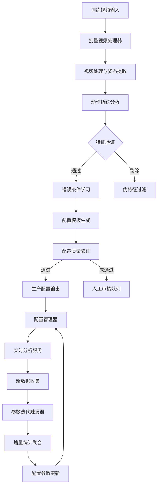

# 测试与微调系统 V2.0

> 基于实际代码实现重新整理的测试与微调系统文档
> 
> **文档说明**：本文档基于 `video_analysis_v2` 项目实际代码实现，重新整理并深化了原 SOP 文档中 2.3 节的内容。重点突出数据驱动、配置迭代和自动化训练的核心设计理念。

## 系统定位

测试与微调系统是一个**数据驱动的动作配置生成与优化平台**，而非简单的 iOS 逻辑同步工具。系统核心目标是通过批量视频训练，自动生成高质量的动作分析配置，并支持持续的参数迭代优化。

### 核心设计理念

1. **数据驱动 (Data-Driven)**: 所有配置参数均从训练数据中自动学习生成
2. **零代码扩展 (Zero-Code Extension)**: 新增动作仅需配置文件 + 训练视频，无需编写 Python 代码
3. **持续学习 (Continuous Learning)**: 支持基于新数据的参数自动迭代优化
4. **质量闭环 (Quality Loop)**: 自动验证配置质量，确保生成配置的可靠性

## 系统架构

### 核心模块组成

```
src/core/training/
├── pipeline.py              # 训练流程管道（主控制器）
├── batch_processor.py       # 批量视频处理器
├── error_learner.py         # 错误条件学习器
└── feature_validator.py     # 特征验证器

src/core/analysis/
├── fingerprint.py           # 动作特征指纹系统
├── exploration.py           # 未知动作探索
└── template_generator.py    # 配置模板生成器

src/core/phases/
├── generic_phase_detector.py # 通用相位检测引擎
└── base.py                  # 相位检测基类

src/core/config/
├── manager.py               # 配置管理器
├── models.py                # 数据模型定义
├── validator.py             # 配置验证器
└── recorder.py              # 执行记录器
```

### 数据流架构



## 核心功能详解

### 1. 批量训练流程 (Batch Training Pipeline)

#### 输入格式
支持两种输入方式：
- **JSON 配置文件**：结构化定义动作、视频和标签
- **命令行参数**：灵活的单次训练

**JSON 配置示例** (`jumping_jack_config.json`)：
```json
{
  "action_id": "jumping_jack",
  "action_name_zh": "开合跳",
  "videos": [
    {"video_path": "./std1.mp4", "tags": ["standard"]},
    {"video_path": "./std2.mp4", "tags": ["standard"]},
    {"video_path": "./err1.mp4", "tags": ["error:knee_valgus"]},
    {"video_path": "./err2.mp4", "tags": ["error:knee_valgus"]}
  ],
  "auto_approve": false
}
```

#### 训练执行
```bash
# 使用配置文件训练
python train_action.py --config jumping_jack_config.json

# 命令行参数训练
python train_action.py \
  --action-id squat \
  --action-name "深蹲" \
  --video ./std1.mp4 --tag standard \
  --video ./err1.mp4 --tag "error:insufficient_depth"
```

### 2. 五阶段训练流程

#### 阶段1：视频处理与指纹提取
- **输入**：原始视频文件 + 标签
- **处理**：姿态估计 → 关键点序列 → 特征计算
- **输出**：`ActionFingerprint`（动作特征指纹）

**关键特性**：
- 支持 BlazePose (33点) 和 YOLO (17点) 模型
- 自动计算 50+ 种生物力学指标
- 生成包含统计特征、动态特征、时序特征的完整指纹

#### 阶段2：特征验证（机器审核）
- **目的**：自动剔除伪特征，确保数据质量
- **验证规则**：
  - NaN 比例 > 30% → 剔除
  - 变化幅度 < 5° → 剔除（无意义变化）
  - 超出物理极限 → 剔除（如膝角 > 180°）
- **输出**：验证通过的特征指纹

#### 阶段3：错误条件学习
- **算法**：对比标准动作与错误动作的统计分布
- **学习策略**：
  1. **范围对比**：错误样本范围是否超出标准范围
  2. **极值对比**：错误样本极值是否偏离标准极值
  3. **统计对比**：均值、方差的显著差异
  4. **模式发现**：特定指标的错误关联性

**学习输出示例**：
```json
{
  "error_id": "knee_valgus_high_knee_valgus",
  "error_name": "膝关节内扣过大",
  "description": "检测到膝关节内扣: 膝关节内扣数值过大 (阈值: 15.0, 置信度: 0.85)",
  "severity": "high",
  "condition": {
    "operator": "gt",
    "value": 15.0,
    "metric_id": "knee_valgus"
  }
}
```

#### 阶段4：配置生成
- **输入**：验证后的特征指纹 + 学习到的错误条件
- **处理**：
  1. 聚合标准动作统计，生成金标准阈值
  2. 构建相位状态机配置
  3. 整合错误判断条件
  4. 计算配置置信度
- **输出**：完整的动作配置 JSON 文件

**生成配置示例** (`squat_trained.json`)：
```json
{
  "action_id": "squat",
  "action_name_zh": "深蹲",
  "version": "1.0.0-trained",
  "phases": [...],
  "metrics": [
    {
      "metric_id": "knee_flexion",
      "enabled": true,
      "thresholds": {
        "target_value": 110.0,
        "normal_range": [95.0, 125.0],
        "excellent_range": [100.0, 120.0]
      },
      "error_conditions": [...]
    }
  ],
  "metadata": {
    "trained_at": "2026-04-11T10:30:00",
    "standard_samples": 5,
    "confidence": 0.82
  }
}
```

#### 阶段5：质量验证
- **验证指标**：
  - 标准样本数 ≥ 3（可配置）
  - 配置置信度 ≥ 0.7（可配置）
  - 错误条件覆盖率
  - 配置完整性检查
- **输出**：质量报告 + 自动审核建议

### 3. 动作特征指纹系统 (Action Fingerprint System)

#### 指纹数据结构
```python
@dataclass
class ActionFingerprint:
    action_id: str                    # 动作ID
    action_name: str                  # 动作名称
    created_at: str                   # 创建时间
    
    # 特征分类
    dominant_metrics: List[MetricFingerprint]    # 主导指标（变化最大的）
    secondary_metrics: List[MetricFingerprint]   # 次要指标
    
    # 全局特征
    total_metrics_analyzed: int       # 分析的指标总数
    active_joints: List[str]          # 活跃关节列表
    symmetry_score: Optional[float]   # 对称性评分
    
    # 元数据
    tags: List[str]                   # 标签：standard, error:xxx, extreme, edge
```

#### 指标指纹结构
```python
@dataclass
class MetricFingerprint:
    metric_id: str                    # 指标ID
    metric_name: str                  # 指标名称
    category: str                     # 类别：angle, distance, curvature
    
    # 统计特征
    mean: float                       # 均值
    std: float                        # 标准差
    min: float                        # 最小值
    max: float                        # 最大值
    range: float                      # 范围
    
    # 动态特征
    total_variation: float            # 总变差
    variance_coefficient: float       # 变异系数
    peak_count: int                   # 峰值数量
    
    # 重要性评分
    significance_score: float         # 基于变化幅度的重要性评分
```

### 4. 通用相位检测引擎 (Generic Phase Detector)

#### 设计理念
将相位检测从**硬编码逻辑**转变为**配置驱动的状态机**：

```python
# 旧方式：硬编码（不可扩展）
class SquatPhaseDetector:
    def detect(self, sequence):
        if knee_angle < 160:  # 硬编码阈值
            return "descent"

# 新方式：配置驱动（可扩展）
class GenericPhaseDetector:
    def detect(self, sequence):
        # 从JSON读取规则
        # 规则1: 如果 knee_flexion 导数 < 0，则进入 descent
        # 规则2: 如果 knee_flexion 达到局部最小值，则进入 bottom
```

#### 状态机配置
```json
{
  "action_id": "squat",
  "phases": [
    {"phase_id": "standing", "phase_name": "站立起始"},
    {"phase_id": "descent", "phase_name": "下蹲过程"},
    {"phase_id": "bottom", "phase_name": "最低点"}
  ],
  "phase_transitions": [
    {
      "from": "standing",
      "to": "descent",
      "driver_signal": "knee_flexion",
      "type": "derivative",
      "params": {"direction": "decreasing", "threshold": -2.0}
    },
    {
      "from": "descent",
      "to": "bottom", 
      "driver_signal": "knee_flexion",
      "type": "extremum",
      "params": {"mode": "valley"}
    }
  ]
}
```

#### 转移条件类型
| 类型 | 说明 | 适用场景 |
|------|------|----------|
| `threshold` | 阈值比较 | `value > 160` |
| `derivative` | 导数判断 | `d(value)/dt < 0`（下降过程） |
| `extremum` | 极值点检测 | 局部最小/最大值（动作转折点） |
| `duration` | 持续时间 | 保持 > 0.5秒（稳定状态） |
| `compound` | 复合条件 | 多条件组合（复杂动作） |

### 5. 参数迭代系统 (Parameter Iteration System)

#### 迭代触发条件
1. **样本量触发**：当特定动作的标准样本数达到阈值（如 100 条）
2. **定时触发**：定期（如每周）重新评估参数
3. **性能下降触发**：在线检测到准确率下降时触发

#### 迭代流程
```python
class ParameterIterationTrigger:
    def check_and_trigger(self, action_id: str) -> bool:
        # 1. 检查样本量
        if db.get_sample_count(action_id, "standard") < 10:
            return False
        
        # 2. 评估当前参数性能
        current_score = self.evaluate_current_params(action_id)
        
        # 3. 计算新参数（基于增量统计）
        new_params = self.compute_new_params(action_id)
        new_score = self.evaluate_params(action_id, new_params)
        
        # 4. 判断是否更新（提升超过5%）
        improvement = (new_score - current_score) / current_score
        if improvement > 0.05:
            self.apply_params(action_id, new_params)
            return True
        return False
```

#### 增量统计聚合
```python
# 聚合标准动作的统计分布
standard_fps = db.get_fingerprints_by_label("standard", action_id="squat")
agg_stats = aggregate_statistics(standard_fps)

# 更新阈值参数
new_thresholds = {
    "target_value": agg_stats["mean"],
    "normal_range": (
        agg_stats["mean"] - agg_stats["std"],
        agg_stats["mean"] + agg_stats["std"]
    ),
    "excellent_range": (
        agg_stats["mean"] - 0.5 * agg_stats["std"],
        agg_stats["mean"] + 0.5 * agg_stats["std"]
    )
}
```

## 标签系统 (Tagging System)

### 标签类型与用途
| 标签 | 用途 | 样本数建议 | 迭代目标 |
|------|------|----------|----------|
| `standard` | 标准动作 | ≥3 | 建立金标准阈值范围 |
| `error:{type}` | 特定错误 | ≥2/类型 | 学习错误判断条件 |
| `extreme` | 极端错误 | ≥1 | 定义边界值 |
| `edge` | 边缘动作 | ≥1 | 细化判断依据 |

### 标签应用示例
```json
{
  "videos": [
    {"video_path": "std1.mp4", "tags": ["standard"]},
    {"video_path": "err_knee.mp4", "tags": ["error:knee_valgus"]},
    {"video_path": "extreme.mp4", "tags": ["extreme"]},
    {"video_path": "edge_case.mp4", "tags": ["edge"]}
  ]
}
```

## 配置管理系统

### 配置目录结构
```
config/action_configs/
├── squat.json                      # 正式配置（已审核）
├── squat_trained.json              # 训练生成的配置
├── generated/                      # 自动生成的配置
│   └── new_jump_v1.json
└── pending/                        # 待审核配置
    └── unknown_action_pending.json
```

### 配置生命周期
1. **探索生成** → `pending/` 目录
2. **人工审核** → 确认或修改
3. **正式启用** → 移动到根目录
4. **迭代更新** → 版本控制更新

### 配置版本管理
```json
{
  "action_id": "squat",
  "version": "1.2.0",
  "previous_version": "1.1.0",
  "change_log": [
    "优化 knee_flexion 阈值范围",
    "新增 lumbar_curvature 检测项",
    "调整 phase_transitions 参数"
  ],
  "updated_by": "training_pipeline",
  "updated_at": "2026-04-11T14:30:00"
}
```

## 探索模式 (Exploration Mode)

### 触发条件
当系统遇到未知动作时自动激活：
```python
config = manager.load_config("new_unknown_action", enable_exploration=True)
# 返回 ExplorationConfig，启用所有检测项进行全量分析
```

### 探索流程
```
新视频输入
    ↓
探索模式激活
    ↓
1. 全量指标计算（所有 MetricDefinition）
    ↓
2. 指纹提取（变化幅度、极值点、主导频率）
    ↓  
3. 主导指标识别（方差/ROM 最大的前3-5个指标）
    ↓
4. 相位候选检测（基于主导指标的时序分析）
    ↓
5. 阈值建议生成（基于统计分析）
    ↓
6. 生成初始配置（JSON）
    ↓
保存到 pending/ 目录待审核
```

## 质量保证机制

### 自动质量检查
1. **样本充足性检查**：标准样本数 ≥ 3，错误样本 ≥ 2/类型
2. **特征有效性检查**：剔除 NaN 比例高、变化幅度小的伪特征
3. **配置完整性检查**：必须包含 phases、metrics、error_conditions
4. **阈值合理性检查**：阈值必须在物理合理范围内

### 置信度计算
```python
def calculate_config_confidence(standard_samples, error_conditions):
    base_confidence = min(0.5 + standard_samples * 0.1, 0.8)
    
    # 有错误条件增加置信度
    if error_conditions:
        error_coverage = min(len(error_conditions) * 0.05, 0.15)
        base_confidence += error_coverage
    
    return min(base_confidence, 0.95)
```

### 人工审核流程
1. **自动审核**：置信度 ≥ 0.8 且满足所有质量要求 → 自动通过
2. **人工审核**：置信度 0.7-0.8 或部分质量要求未满足 → 人工确认
3. **拒绝**：置信度 < 0.7 或关键质量要求未满足 → 拒绝并反馈

## 实际应用示例

### 案例：开合跳动作训练
```bash
# 1. 准备配置文件
cat > jumping_jack_config.json << EOF
{
  "action_id": "jumping_jack",
  "action_name_zh": "开合跳",
  "videos": [
    {"video_path": "videos/jj_std1.mp4", "tags": ["standard"]},
    {"video_path": "videos/jj_std2.mp4", "tags": ["standard"]},
    {"video_path": "videos/jj_std3.mp4", "tags": ["standard"]},
    {"video_path": "videos/jj_err_knee1.mp4", "tags": ["error:knee_valgus"]},
    {"video_path": "videos/jj_err_knee2.mp4", "tags": ["error:knee_valgus"]}
  ],
  "auto_approve": false
}
EOF

# 2. 执行训练
python train_action.py --config jumping_jack_config.json

# 3. 输出结果
=== 开始批量训练: jumping_jack ===
视频总数: 5
[阶段1] 处理视频，提取指纹... 成功处理: 5
[阶段2] 机器审核: 验证特征质量... 标准动作: 剔除 0 个伪特征, 保留 3
[阶段3] 学习错误判断条件... 学习错误类型: knee_valgus (样本数: 2)
[阶段4] 生成配置文件... 配置已保存: config/action_configs/jumping_jack_trained.json
[阶段5] 验证配置质量... 质量检查: 需要人工审核
✓ 动作ID: jumping_jack
✓ 配置文件: config/action_configs/jumping_jack_trained.json
✓ 处理视频数: 5
✓ 配置置信度: 0.75
⚠ 配置需要人工审核后才能投入使用
```

### 案例：参数迭代更新
```python
# 收集新数据
new_videos = [
    {"video_path": "new_std1.mp4", "tags": ["standard"]},
    {"video_path": "new_std2.mp4", "tags": ["standard"]},
]

# 添加到指纹数据库
for video in new_videos:
    fingerprint = analyzer.analyze(video["video_path"], tags=video["tags"])
    db.add_fingerprint(fingerprint, label="standard")

# 触发参数迭代
if iteration_trigger.check_and_trigger("squat"):
    print("参数已自动更新")
    # 新配置生效，下次分析使用更新后的参数
```

## 系统优势

### 1. 效率提升
- **训练时间**：从人工数天 → 自动数小时
- **配置生成**：从专家经验 + 手工调试 → 数据驱动自动生成
- **错误发现**：从人工观察 → 自动对比学习

### 2. 质量保证
- **一致性**：所有配置基于相同算法生成，避免人为差异
- **可追溯性**：完整记录训练数据、生成参数和版本历史
- **可验证性**：自动质量检查 + 置信度评分

### 3. 可扩展性
- **新动作支持**：无需编写代码，仅需训练视频
- **参数优化**：持续学习，越用越准
- **知识积累**：指纹数据库积累动作特征知识

### 4. 可维护性
- **配置驱动**：所有逻辑在 JSON 配置中，易于理解和修改
- **模块化设计**：各组件独立，便于测试和升级
- **版本控制**：完整配置历史，支持回滚和对比

## 与 iOS 端集成

### 配置格式兼容
生成的 JSON 配置可直接用于 iOS 端：
```swift
// iOS 端加载配置
if let configPath = Bundle.main.path(forResource: "squat_trained", ofType: "json") {
    let configData = try Data(contentsOf: URL(fileURLWithPath: configPath))
    let actionConfig = try JSONDecoder().decode(ActionConfig.self, from: configData)
    // 使用配置进行实时分析
}
```

### 实时分析流程
1. **视频输入**：iOS 摄像头实时视频流
2. **姿态估计**：使用端侧优化模型（如 MediaPipe）
3. **相位检测**：根据配置的状态机规则检测动作阶段
4. **指标计算**：在关键阶段计算配置的检测项
5. **错误判断**：应用学习到的错误条件进行实时反馈

### 双向数据流
```
iOS 端实时分析 → 云端收集用户数据 → 训练系统增量学习 → 更新配置 → iOS 端更新
```

## 未来优化方向

### 短期优化（1-2个月）
1. **在线学习**：实时根据用户反馈调整参数
2. **A/B测试框架**：新旧参数版本并行对比
3. **可视化训练工具**：训练过程可视化，便于调试

### 中期优化（3-6个月）
1. **迁移学习**：相似动作间共享参数（深蹲→弓步蹲）
2. **多模态融合**：结合 IMU 数据提高准确性
3. **个性化适配**：根据用户身体特征调整阈值

### 长期愿景（6-12个月）
1. **完全自动化**：从视频收集到部署上线全自动流程
2. **智能诊断**：不仅判断错误，还能提供纠正建议
3. **预防性分析**：预测潜在损伤风险，提前干预

## 总结

测试与微调系统 V2.0 实现了从**人工经验驱动**到**数据驱动**的根本转变。通过自动化训练流程、智能错误条件学习和持续参数迭代，系统能够：

1. **快速上线新动作**：从数天缩短到数小时
2. **保证分析质量**：通过机器审核和置信度评分
3. **持续优化改进**：基于用户数据自动迭代参数
4. **降低维护成本**：配置驱动，无需代码修改

这套系统不仅解决了原 SOP 中描述的测试与微调需求，更构建了一个完整的动作分析配置生命周期管理平台，为视频分析系统的规模化应用奠定了坚实基础。


---
# FQA
### 在学习什么？
```text
1. 描述性统计：从标准动作中学习"正常应该是什么样子"
2. 判别性统计：从错误动作中学习"什么样子算错误"
3. 阈值优化：找到区分正常和错误的最佳边界值
4. 特征选择：识别哪些指标对这个动作最重要（通过 significance_score）
```
- 为什么这样做？ -> 对判别条件 增加解释性（类似 上海人工智能实验室的 书生 讲棋 功能）
- 数据 + 专家知识 驱动的专家系统，自动从数据中学习生成规则，而非依赖人工经验

### 50+ 种生物力学指标 是什么？
- 基于 解剖学和运动学原理 AI可以解释的指标体系，涵盖了关节角度、位置关系、活动范围、体块轮廓等多个维度。以下是部分示例：

| 分类               | 英文                     | 描述           | 指标数量 |
| ------------------ | ------------------------ | -------------- | -------- |
| 关节角度（矢状面） | `joint_angle_sagittal`   | 矢状面关节角度 | 6        |
| 关节角度（冠状面） | `joint_angle_frontal`    | 冠状面关节角度 | 4        |
| 关节角度（水平面） | `joint_angle_transverse` | 水平面关节角度 | 1        |
| 位置关系           | `position`               | 关键点相对位置 | 2        |
| 位置对齐           | `position_alignment`     | 身体部位对齐度 | 2        |
| 位置对称           | `position_symmetry`      | 左右对称性     | 1        |
| 活动范围           | `rom`                    | 关节活动范围   | 1        |
| 体块轮廓           | `segment`                | 身体段轮廓特征 | 3        |
| 稳定性             | `stability`              | 动作稳定性指标 | 1        |

### 特征验证中的 特征是指什么？
*"特征"指的是从生物力学指标计算出的 MetricFingerprint（指标指纹）*
- 统计特征的合理性：
  1. 信号质量
  2. 物理合理性
  3. 数据稳定性
特征验证阶段的"特征" = 从生物力学指标时间序列中提取的统计特征（MetricFingerprint）
### 特征指纹 应该如何生成？
```python
return MetricFingerprint(
    metric_id=metric_id,
    metric_name=metric_def.name_zh,
    category=metric_def.category.value,
    mean=mean,
    std=std,
    min=min_val,
    max=max_val,
    range=range_val,
    total_variation=float(total_variation),
    variance_coefficient=float(variance_coef),
    peak_count=len(peaks),
    valley_count=len(valleys),
    significance_score=float(significance),
)
```
假设分析一个深蹲动作，系统会：
1. 计算所有52个生物力学指标的时间序列
2. 为每个指标生成特征指纹：
   - knee_flexion: range=120°, significance=150
   - knee_valgus: range=15°, significance=18
   - trunk_lean: range=30°, significance=35
   - ...
3. 识别主导指标（变化幅度大的）：
   - knee_flexion (range=120°)
   - hip_flexion (range=110°)
   - ankle_dorsiflexion (range=40°)
4. 生成动作指纹：
   - dominant_metrics: knee_flexion, hip_flexion, ...
   - active_joints: "knee", "hip", "ankle"
   - symmetry_score: 0.85
